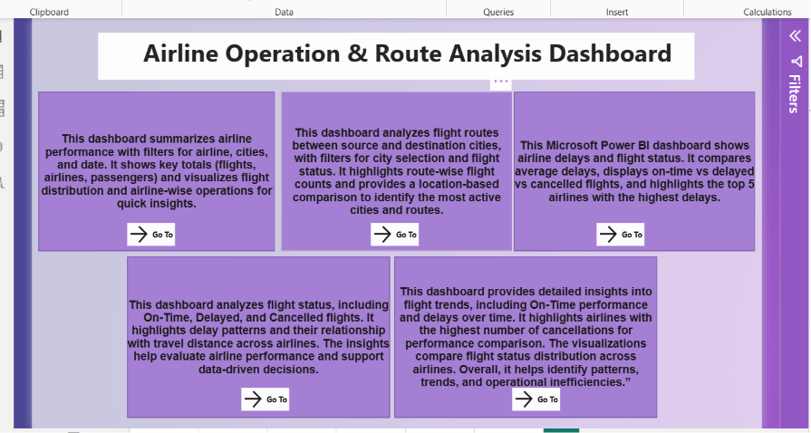

# ✈️PowerBI-Airline-Performance-Dashboard

> An interactive Power BI dashboard designed to analyze airline operations, monitor flight performance, and generate actionable business insights through data visualization.

---

## 📖 Project Overview

The Airline Performance Analysis Dashboard is an end-to-end Business Intelligence project developed in **Power BI**. It transforms raw airline data into meaningful visual insights, enabling users to monitor operational performance, identify trends, and support data-driven decision-making.

This project demonstrates the complete Power BI workflow, including data cleaning, transformation, modeling, DAX calculations, and dashboard development.

---

## 🎯 Business Objectives

- Analyze overall airline performance.
- Monitor flight delays and cancellations.
- Compare airline operational efficiency.
- Identify high-performing and low-performing airlines.
- Track flight trends across different cities and time periods.
- Support better business decisions using interactive dashboards.

---

## 🛠️ Tools & Technologies

| Tool | Purpose |
|------|---------|
| Power BI | Dashboard Development |
| Power Query | Data Cleaning & Transformation |
| DAX | Calculated Measures & KPIs |
| Data Modeling | Table Relationships |
| Microsoft Excel | Data Source |

---

## 📊 Dashboard Features

### Executive KPIs
- Total Flights
- On-Time Flights
- Delayed Flights
- Cancelled Flights

### Visualizations
- Flight Status Distribution
- Flights by Airline
- Average Delay by Airline
- Flights by Source City
- Flights by Destination City
- Monthly Flight Trends
- Interactive Slicers for Dynamic Filtering

---

## 📈 Key Business Insights

- Evaluated airline performance using operational KPIs.
- Identified airlines with the highest delay rates.
- Analyzed cancellation patterns across airlines.
- Compared flight volume across different cities.
- Discovered monthly trends in airline operations.
- Enabled interactive filtering for deeper analysis.

---

## 📁 Project Structure

```## 📁 Project Structure

```text
PowerBI-Airline-Performance-Dashboard/
│── README.md
│── Airline Dashboard.pbix
│── airline_data.json
│── images/
│     ├── 
│     ├── Screenshot 2026-07-12 033222.png
│     ├── Screenshot 2026-07-12 033300.png
│     ├── Screenshot 2026-07-12 033350.png
│     ├── Screenshot 2026-07-12 033449.png
│     └── Screenshot 2026-07-12 033523.png

---

## 📷 Dashboard Preview

### 🏠 Home Dashboard

This landing page provides an overview of the entire report and allows users to navigate to different analytical dashboards using interactive buttons.



### ✈️ Flight Distribution & Airline Performance Report

This dashboard provides an overview of flight distribution, airline performance, key operational KPIs, and interactive visualizations to analyze airline operations.


### 🗺️ Route Analysis

This dashboard analyzes flight routes to identify the busiest connections, airport traffic, and route performance across different locations.


### ⏱️ Flight Delay Analysis

This dashboard provides insights into flight delays, helping identify delay patterns across airlines, routes, and operational performance.


### 📊 Flight Status Distribution

This dashboard analyzes the distribution of flight statuses, including **On-Time**, **Delayed**, and **Cancelled** flights. It helps stakeholders monitor operational performance and identify trends affecting flight reliability.


### 📈 Flight Trends & Detailed Insights

This dashboard presents flight trends and detailed operational insights, enabling users to monitor performance over time and identify key business patterns.


---

## 🚀 Skills Demonstrated

- Data Cleaning
- ETL Process
- Data Modeling
- DAX Calculations
- KPI Development
- Dashboard Design
- Business Intelligence
- Data Visualization
- Analytical Thinking

---

## 💼 Project Outcome

This dashboard enables stakeholders to quickly monitor airline performance, identify operational issues, and make informed decisions through interactive visual analytics.

---

## 👩‍💻 About Me

**Yogita Thakur**

Aspiring Data Analyst passionate about transforming data into actionable business insights.

### Skills
- SQL
- Python
- Power BI
- Excel
- Tableau
- Data Visualization
- Business Intelligence

---

## 📬 Connect With Me

- LinkedIn: www.linkedin.com/in/your-linkedin
- GitHub: https://github.com/your-github

---

⭐ If you found this project useful, consider giving it a star!
